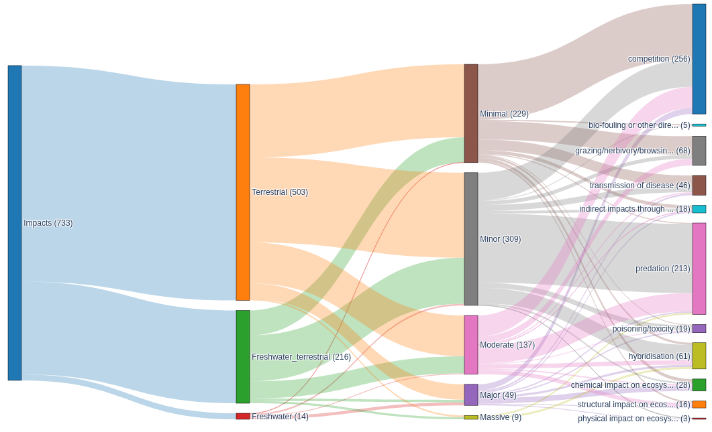

To accurately assess the performance of the automatic impact extraction performed by the tool we can perform automatic comparison to the "gold-standard" set of extracted EICAT impact assessments already available on the GISD website. However this does not tell us about how well an LLM performs this task but simply how closely it can match the performance of a single human on the task. To understand the performance of an LLM on this task we must first assess how well humans agree when performing the task, if the EICAT guidelines are robust and unambiguous enoguh to avoid disagreements and how much ambiguity in reference texts might contribute to differences between human annotators.

# Inter Annotator Agreement (IAA)
To evaluate inter annotator agreement we propose taking a set of referenced texts and tasking multiple human annotators to perform an assessment as the would when performing an EICAT assessment. As such we can then analyse the Inter-Annotator Agreement (IAA) accross a range of reference texts.

## Paper Assignment

Our group of volunteer annotators will perform data extraction on 15 papers each. In order to achieve a good statistical coverage we will distribute papers based on @cameron2022balanced (BIBD) whereby all annotators will perform data extraction on a small block of papers, then pairwise extraction will be performed on a wider set. This ensures that we will be able to examine agreement across a large number of annotators on the core block and accross a wider number of papers on those annotated pairwise. Further to this we will stratify the block(s) based on the ecological system defined in the paper (marine, freshwater, terrestrial). This will allow us to examine any variablibity in IAA within systems.

Each annotator will therefore perform data extraction on 15 papers broken down as:

- 6 core papers
- 9 papers additional papers

This means that in total, assuming a pairwise grouping of the 9 additional papers and $n$ annotators, the total number of papers examined in the evaluation will be:
$6 + \frac{9n}{2}$. Assuming around $n \approx 10$ annotators this will yield $\approx 51$ papers.

Papers will be selected from those available in the GISD to ensure a representative distribution across ecological system, EICAT impact category, and impact mechanism. The breakdown of available GISD assessments across these dimensions is shown below, and will guide the selection so that no single category or mechanism dominates the annotation set.

{fig-align="center" width="100%"}

## Metrics
There are a range of potential metrics that could be applied to assess IAA.

### Cohen's Kappa
@cohen1960coefficient's Kappa can be used for comparing the observations of two annotators assigning categorical labels per observation.
$$
\kappa = \frac{p_o - p_e}{1 - p_e}
$$

where $p_o$ is the observed agreement and $p_e$ is the expected agreement by chance, correcting for the possibility that annotators agree randomly rather than substantively.

Whilst Cohen's Kappa is widely adopted and allows us to examine agreement in categorical labels such as EICAT category or mechanism, it only captures agreement between 2 annotators. This means it is applicable to the pairwise papers but not to the core block annotated by all.

### Krippendorff's alpha
Unlike Cohen's Kappa, @krippendorff1980content's alpha can allow us to examine the IAA between more than 2 annotators on the same item which makes it ideal for analysing the core block of papers, as well as being useful for those in the pairwise block. It is defined by:
$$
\alpha = 1 - \frac{D_o}{D_e}
$$

where $D_o$ is the observed disagreement and $D_e$ is the expected disagreement, both computed from a coincidence matrix of annotator value assignments. It additionally accepts a scale-appropriate metric function, distinguishing between nominal disagreements (any mismatch counts equally) and ordinal disagreements (larger gaps between values are penalised more heavily).

### Interpreting Agreement Scores

Both Cohen's Kappa and Krippendorff's alpha produce values in the range $[-1, 1]$, where $0$ indicates agreement no better than chance and $1$ indicates perfect agreement. We adopt the conventional interpretation thresholds proposed by @landis1977measurement:

| Score | Interpretation |
|:------|:---------------|
| $< 0.00$ | Poor |
| $0.00$–$0.20$ | Slight |
| $0.21$–$0.40$ | Fair |
| $0.41$–$0.60$ | Moderate |
| $0.61$–$0.80$ | Substantial |
| $0.81$–$1.00$ | Almost perfect |

### Weighted Cohen's Kappa {#sec-weighted-kappa}

The EICAT impact categories are ordinal (MC < MN < MO < MR < MV), meaning that a disagreement between adjacent categories (e.g. MN and MO) is less severe than one spanning many levels (e.g. MC and MV). Standard Cohen's Kappa treats all disagreements as equivalent, which is inappropriate for ordinal data. We therefore also compute a linearly weighted Kappa @cohen1968weighted for category-level agreement, in which the penalty for disagreement scales with the distance between the two assigned categories.

## Evaluation Dimensions

IAA should be assessed independently across the key structured fields produced during data extraction. These are summarised below:

| Field | Scale | Metric |
|:------|:------|:-------|
| Impact mechanism | Nominal | Cohen's Kappa / Krippendorff's alpha |
| EICAT category | Ordinal | Weighted Kappa / Krippendorff's alpha |
| Confidence rating | Ordinal | Weighted Kappa |
| Impact presence/absence | Binary | Precision, Recall, F1 |

Agreement may vary substantially across these dimensions. Category-level agreement is likely to be lower than mechanism-level agreement, given the greater ambiguity in the EICAT category boundaries relative to the relatively clear-cut distinctions between impact mechanisms. Evidence text and impacted species lists do not admit direct agreement scoring and will be examined qualitatively.

# Alternative Approaches and Perspectives

The metrics described above treat disagreement as noise to be minimised and measure how closely annotators converge on a single answer. A growing body of NLP research argues instead that disagreement is a meaningful signal, particularly in domains where label boundaries are genuinely ambiguous. Under this *perspectivist* view [@leonardelli2021agreeing], annotators would provide a distribution of confidence across categories rather than a single label, and the resulting distribution becomes the gold standard. A system would then be evaluated on how well its output matches that distribution — for example via Jensen-Shannon divergence — rather than on exact agreement with a majority label. Given the acknowledged ambiguity in the EICAT category boundaries, this framing may be more epistemically appropriate than a hard-label IAA ceiling.

Item Response Theory (IRT), a psychometric framework recently applied to NLP evaluation [@lalor2019learning], offers a complementary perspective. Rather than characterising annotator agreement in aggregate, IRT models individual items by their *difficulty* (how often annotators disagree on them) and *discriminability* (how well they distinguish between annotators of different ability). Applied to the core annotation block, IRT could identify which papers produce consistent assessments regardless of annotator and which are inherently ambiguous — providing a richer interpretation of any observed IAA than a single aggregate score.

With respect to the LLM-as-judge component, recent empirical work has documented systematic failure modes including agreeableness bias (high recall, poor precision) and a drop in human alignment to 64–68% on expert-knowledge tasks, below typical inter-expert baselines [@zheng2023judging; @koo2024reliable]. Research also suggests that providing few-shot examples of correct evaluations in the judge prompt substantially improves alignment with human judgement, which may be worth considering in the design of the judge agent.

# Automatic Evaluation

In addition to IAA, we evaluate the performance of the data extraction system against a gold standard constructed from existing human-curated EICAT assessments. This allows us to quantify system performance on a broader set of papers than can be practically annotated in the IAA exercise.

## Gold Standard Construction

The Global Invasive Species Database (GISD) provides a curated collection of EICAT impact assessments for a large number of invasive species, each linked to the reference from which the assessment was derived. We use these as the basis for an automated evaluation dataset. For each reference-species pairing in the GISD data, a test case is constructed comprising a directory containing the bibliographic reference for the source paper along with the set of gold standard impact records attributed to that paper. Where multiple species are assessed from the same reference, a separate test case is produced per species. The source PDF for each reference must be retrieved manually.

It should be noted that GISD assessments represent the judgement of a single assessor and are therefore subject to the same inter-annotator variability characterised in the IAA section. Performance against this gold standard should be interpreted in that context: agreement with the gold standard that falls within the range of observed human-to-human variability indicates that the system is performing at a broadly human-equivalent level.

## LLM-as-Judge Evaluation

Comparing extracted impacts to a gold standard presents a challenge of semantic equivalence. An LLM and a human assessor may describe the same observed impact in different terms, making exact string matching unreliable. To address this, we employ an LLM-as-judge approach in which a separate LLM agent semantically pairs predicted impacts with gold standard impacts.

The judge agent is presented with both lists of impacts and tasked with determining which predicted impacts correspond to which gold standard impacts, based on semantic similarity of the evidence text and the identified mechanism. Minor wording differences are treated as compatible matches. For each predicted impact the judge produces either a matched gold standard impact or `None` if no suitable match exists. TP, FP, and FN counts are derived from these pairings.

It should be noted that using a model from the same family for both extraction and evaluation introduces a potential for systematic bias, as the judge may be more inclined to favour the phrasing or interpretation style of the extracting model. This should be taken into account when interpreting results, particularly when comparing system performance against the human IAA baseline.

## Metrics

From the TP, FP, and FN counts produced by the judge, precision, recall, and F1 score are computed at the level of impact detection:

$$
\text{precision} = \frac{TP}{TP + FP}, \quad \text{recall} = \frac{TP}{TP + FN}, \quad F_1 = \frac{2 \cdot \text{precision} \cdot \text{recall}}{\text{precision} + \text{recall}}
$$

These metrics assess whether the system correctly identifies the impacts present in a paper without hallucinating spurious ones. For matched impact pairs, category classification and confidence rating accuracy are assessed separately using the weighted Kappa formulation described in @sec-weighted-kappa.

# Relating IAA to System Performance

The IAA evaluation establishes a human performance ceiling against which the system can be benchmarked. A system whose agreement with a gold standard assessor falls within the range of observed human-to-human agreement on a given dimension can be considered to be performing at a human-equivalent level on that dimension.

We expect category-level agreement to be the most challenging dimension for both human annotators and the LLM system, given the inherent ambiguity in distinguishing adjacent EICAT categories. High IAA on a given dimension signals that the task is well-specified and that departures from the gold standard are more likely attributable to system limitations. Low IAA signals that some level of disagreement is unavoidable regardless of system capability, and that the gold standard itself is a noisy target.

## References

::: {#refs}
:::
